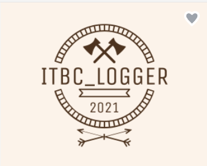

1. Name: ITBC-logger-demo
2. Project documentation:
   1. Technologies used on the project:
      1. Java version 19
      2. Microsoft SQL server management studio 18
      3. Spring Boot version 2.7.5
         1. Dependencies: Spring WEB, Spring Data JPA, Spring Data JDBC
   2. Endpoint list:
      1. /api/clients/register - put
      2. /api/clients/login - put
      3. /api/logs/create - put
      4. /api/logs/search - get
      5. /api/clients - get
      6. /api/clients/{clientsId/reset-password} - patch
3. Installation and setup
   1. List of querries necesary for setting up the base is in the project file "Sql Help"
   2. Tables in the base:
      1. Clients (id, username, password, email, userType)
      2. Logs (logID, message, logType, createdDate, id)
   3. Setting up application.properties is really important for normal functioning of the base. To set up, data base name, username and password in the application.properties need to match with SQL server autentication in the base.
4. Application description:
   1. ITBC-logger-demo is Web application that allows application users to create logs. There are 3 types of logs that can be created: "Error", "Warning" and "Info". Logs will be stored in our database, and they will be avaliable to our users, whenever they need them. Our clients can have easier access to desireable logs by using application filters: Date from, Date to, Message, Log Type.
5. Important note: Administrators for this application can't be registered through application. They need to be registered through database, because of security procedure.
6. Author: Slavko Dacevic-IT Bootcamp trainee :)